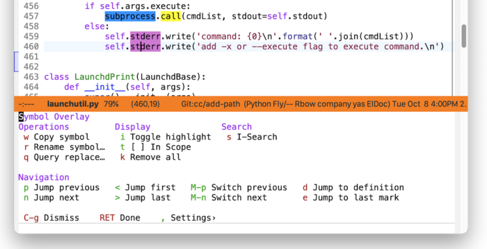

#+startup: overview nologdone
#+startup: showeverything
#+TITLE: Casual Symbol Overlay User Guide
#+SUBTITLE: for version {{{version}}}
#+AUTHOR: Charles Y. Choi
#+EMAIL: kickingvegas@gmail.com
#+OPTIONS: ':t toc:t author:t email:t H:4 f:t
#+LANGUAGE: en
#+MACRO: version 2.0.1
#+MACRO: kbd (eval (org-texinfo-kbd-macro $1))
#+TEXINFO_FILENAME: casual-symbol-overlay.info
#+TEXINFO_CLASS: casual
#+TEXINFO_HEADER: @syncodeindex pg cp
#+TEXINFO_HEADER: @paragraphindent none
#+TEXINFO_TITLEPAGE: t
#+TEXINFO_DIR_CATEGORY: Emacs misc features
#+TEXINFO_DIR_NAME: Casual Symbol Overlay
#+TEXINFO_DIR_DESC: A Transient user interface for Symbol Overlay.
#+TEXINFO_PRINTED_TITLE: Casual Symbol Overlay User Guide

Version: {{{version}}}

#+TEXINFO: Copyright © 2026 @w{Charles Y. Choi}

Casual Symbol Overlay is an opinionated Transient ([[info:transient#Top][transient#Top]]) user interface for [[https://github.com/wolray/symbol-overlay][Symbol Overlay]], a package to highlight symbols with overlays while providing a keymap for various operations on highlighted symbols.

Casual Symbol Overlay is designed to bring discoverability to many Symbol Overlay commands for an enhanced navigation and editing experience.

Casual Symbol Overlay is an extension package to Casual ([[info:casual#Top]]), which is included as a dependency.

#+INCLUDE: "./sponsorship.org"

* Copying
:PROPERTIES:
:COPYING: t
:END:

Copyright © 2026 Charles Y. Choi

* Features
:PROPERTIES:
:CUSTOM_ID: features
:END:
#+CINDEX: Features

TBD

* Requirements
:PROPERTIES:
:CUSTOM_ID: requirements
:END:
#+CINDEX: Requirements

Casual Symbol Overlay requires [[https://github.com/magit/transient][Transient]] 0.9+. Versions of GNU Emacs 30.1 or greater will satisfy this requirement with its built-in version of Transient.

The following packages are also required but will be installed as dependencies if not present.

- [[https://github.com/kickingvegas/casual][Casual]] ≥ 3.0.0
- [[https://github.com/wolray/symbol-overlay][Symbol Overlay]] ≥ 4.2    

Casual Symbol Overlay has been verified with the following configuration.

- GNU Emacs 31.1 (macOS 15.7, Ubuntu Linux 22.04.5 LTS)
- Symbol Overlay 4.3

* Install
:PROPERTIES:
:CUSTOM_ID: install
:END:
#+CINDEX: Install

Casual Symbol Overlay is intended to be installed via ~package-install~ from MELPA, either directly or as a dependency to [[https://github.com/kickingvegas/casual-suite][Casual Suite]]. After this installation, Casual Symbol Overlay can be setup in a number of ways, as enumerated in the sub-sections below.

** Setup with Casual Suite

If you have Casual Symbol Overlay installed as a dependency to [[https://github.com/kickingvegas/casual-suite][Casual Suite]], then Casual Suite will automatically setup Casual Symbol Overlay. Refer to the Casual Suite [[https://github.com/kickingvegas/casual-suite#install][Install section]] for more detail.

Note that this will only work if Casual Symbol Overlay is installed via ~package-install~.

** Setup with Casual only

Casual Symbol Overlay includes the base Casual package as a dependency. Casual has the command ~casual-init~ which will setup all modules within it as specified in the hook variable ~casual-init-hook~. Casual Symbol Overlay can be included in this hook with the following Elisp added to your Emacs initialization file:

#+begin_src elisp :lexical no
  (add-hook 'casual-init-hook #'casual-symbol-overlay-init)
#+end_src

Note that this will only work if Casual Symbol Overlay is installed via ~package-install~.

** Setup Casual Symbol Overlay only

If only setup for Casual Symbol Overlay is desired, then directly run the command ~casual-avy-init~, either manually with ~extended-execute-command~ (~M-x~) or by adding it to your Emacs initialization file.

#+begin_src elisp :lexical no
  (casual-symbol-overlay-init)
#+end_src

Note that this will only work if Casual Symbol Overlay is installed via ~package-install~.

** Manual Install

Casual Symbol Overlay is installed outside of ~package-install~, then add the following lines to your Emacs initialization file.

#+begin_src elisp :lexical no
  (require 'casual-symbol-overlay) ;; optional if using autoloaded menu
  (keymap-set symbol-overlay-map casual-keybinding-primary #'casual-symbol-overlay-tmenu)
#+end_src

* Feedback & Discussion
#+CINDEX: Feedback
Please report any feedback about *Casual Symbol Overlay* to the [[https://github.com/kickingvegas/casual-symbol-overlay/issues][issue tracker on GitHub]].

#+CINDEX: Discussion
To participate in general discussion about using *Casual Symbol Overlay*, please join the [[https://github.com/kickingvegas/casual-symbol-overlay/discussions][discussion group]].

* Sponsorship
#+CINDEX: Sponsorship

#+INCLUDE: "./sponsorship.org"

* About
#+CINDEX: About

[[https://github.com/kickingvegas/now-playing][now-playing.el]] was conceived and crafted by Charles Choi in San Francisco, California.

Thank you for using *now-playing.el*.

Always choose love.

* Acknowledgments
#+CINDEX: Acknowledgments

* Main Index
:PROPERTIES:
:INDEX:    cp
:END:

Index for this user guide.

* Variable Index
:PROPERTIES:
:INDEX:    vr
:END:

Variables, functions, commands, and menus referenced by this user guide.
